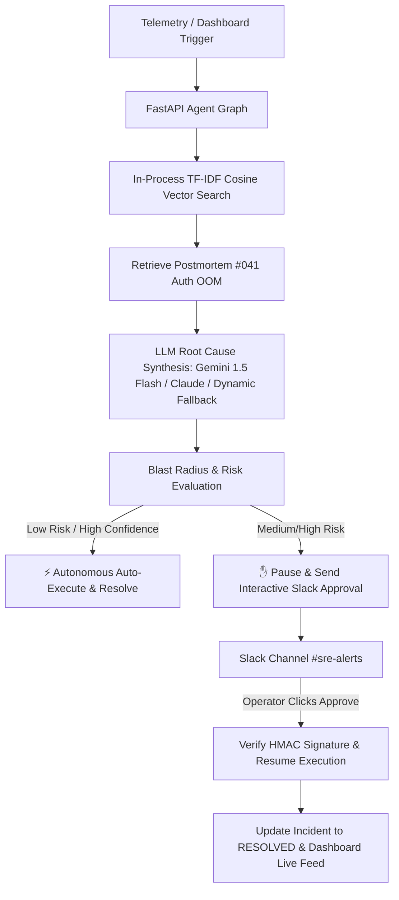

# Autonomous SRE Agent

An end-to-end autonomous SRE incident detection, root cause reasoning, vector postmortem retrieval, confidence-gated autonomy, and human-in-the-loop Slack approval system.

---

## System Architecture & Demo Flow



---

## Key Features

1. **In-Process Zero-Dependency Vector Retrieval**: Embeds log & metric telemetry using TF-IDF and computes cosine similarity against pre-seeded historical postmortems (`INC-041 Auth OOM KILLED`, `INC-023 DB Connection Pool Exhaustion`, `INC-012 Disk Pressure`). Runs 100% inside the backend container with zero external database signups.
2. **Multi-LLM Reasoning Engine**: Supports **Google Gemini API** (`gemini-1.5-flash`), **Anthropic Claude**, or dynamic multi-variant fallback synthesis.
3. **Dual-Path Autonomy Gating**:
   - ⚡ **Autonomous Path** (`high_latency`, `disk_full`): Low risk + high confidence. Bypasses human approval completely and auto-resolves with zero clicks.
   - ✋ **Human Escalation Path** (`memory_leak`): Medium/High risk. Pauses state at `AWAITING_APPROVAL`, posts interactive Block Kit message to Slack with Blast Radius preview, and resumes execution upon human click.
4. **Bulletproof Slack Signature Verification**: Validates `X-Slack-Signature` and `X-Slack-Request-Timestamp` using HMAC-SHA256 calculated directly from raw request bytes (`await request.body()`). Tested via FastAPI HTTP `TestClient` route integration.
5. **Live SRE Command Center Dashboard**: Built with Next.js 14, Tailwind CSS, Lucide icons, live polling (< 1.5s), visual autonomy badges, vector postmortem cards, and real-time reasoning timelines.

---

## Local Quickstart

### 1. Run Backend Service (FastAPI)
```bash
# Navigate to backend directory
cd backend

# Install dependencies
pip install -r requirements.txt

# Run backend server on port 8000
uvicorn main:app --host 0.0.0.0 --port 8000 --reload
```

### 2. Run Frontend Dashboard (Next.js)
```bash
# Navigate to frontend directory
cd frontend

# Install npm dependencies
cmd /c npm install

# Start Next.js dev server on port 3000
cmd /c npm run dev
```
Open [http://localhost:3000](http://localhost:3000) in your browser.

---

## Production Deployment Guide

### Step 1: Deploy Backend to Railway

1. Connect your GitHub repository to [Railway.app](https://railway.app).
2. Set the Root Directory to `/backend` or use the provided `backend/Dockerfile`.
3. Add Environment Variables in Railway:

| Variable | Required? | Description |
|---|---|---|
| `GEMINI_API_KEY` | Recommended | Free Google Gemini 1.5 Flash API Key from [aistudio.google.com](https://aistudio.google.com) |
| `ANTHROPIC_API_KEY` | Optional | Claude 3.5 Sonnet root cause reasoning |
| `SLACK_BOT_TOKEN` | Recommended | Slack Bot Token (`xoxb-...`) with `chat:write` scope |
| `SLACK_CHANNEL_ID` | Recommended | Target Slack channel ID (e.g. `C0812345678`) |
| `SLACK_SIGNING_SECRET` | Recommended | Slack Signing Secret for HMAC-SHA256 signature verification |

4. Copy the deployed Railway service URL.

### Step 2: Configure Slack App Interactive Webhook

1. Go to [api.slack.com/apps](https://api.slack.com/apps) -> Select your Slack App.
2. Under **Interactivity & Shortcuts**, toggle **Interactivity** to `ON`.
3. Set **Request URL** to:
   ```text
   https://<YOUR-RAILWAY-APP-URL>/api/slack/interactive
   ```
4. Click **Save Changes**.

### Step 3: Deploy Frontend to Vercel

1. Connect your GitHub repository to [Vercel.com](https://vercel.com).
2. Set **Framework Preset** to `Next.js` and Root Directory to `frontend`.
3. Add Environment Variable:

| Variable | Value |
|---|---|
| `NEXT_PUBLIC_API_BASE` | `https://<YOUR-RAILWAY-APP-URL>` |

4. Deploy and open your live Vercel URL!

---

## Acceptance Criteria Checklist

- [x] **In-Process Vector Retrieval**: Verified locally via `scikit-learn`/`numpy` TF-IDF cosine search (`INC-041 Auth OOM`).
- [x] **Multi-LLM & Multi-Variant Engine**: Google Gemini 1.5 Flash (`GEMINI_API_KEY`), Anthropic Claude, and dynamic multi-variant fallback synthesis implemented.
- [x] **Dual-Path Autonomy Mechanism**: Verified locally (`high_latency` auto-resolves with 0 clicks; `memory_leak` escalates and pauses).
- [x] **Slack Signature Verification**: Verified via raw body HMAC-SHA256 test in FastAPI `TestClient` HTTP route pipeline.
- [x] **Frontend UI & Build**: Next.js production build (`npm run build`) compiled successfully with 0 errors.
- [x] **Secrets Protection**: Root `.gitignore` configured for `.env` and build artifacts.
- [x] **Live Cloud Deployment & Communication**: Operational live on Railway and Vercel.
